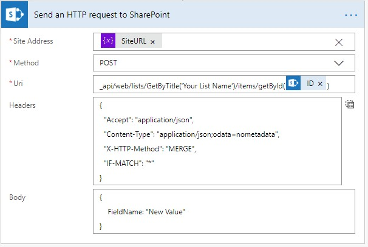

##A handy tip for using MS Flow and SharePoint when you don't want to hard-code the site's URL, but need to update a field value.

<!-- end -->

MS Flow (Power Automate) makes it very easy to update SharePoint fields. Just add the Update Item action to your flow, type in the URL of the SharePoint site you want to work with and select a List. You'll be shown all the available fields in the list and can just insert your new values.

But that only works if you hard-code the URL of the site. If you're making multiple updates in your Flow, that can quickly become tedious. And if you ever need to update the URL, you'll have to find every instance and update it. It's much easier to set your URL once as a variable and reference that instead.

But...the Update Item action won't let you use a variable!

As an alternative, you can use the action Send an HTTP request to SharePoint.

You'll want to set up the action as a POST method, using your site URL variable for the Site Address. In this example, I'm hard-coding the List Name, but that could be a variable as well. The ID Number would be coming from the trigger or an earlier action.

The URI is

```
_api/web/lists/GetByTitle('Your List Name')/items/getById(YourIDNumber)
```

You'll need to add the following headers:
```json
{
  "Accept": "application/json",
  "Content-Type": "application/json;odata=nometadata",
  "X-HTTP-Method": "MERGE",
  "IF-MATCH": "*"
}
```

And then finally in the Body of the request, place your fields with the new values as JSON: 
```json
{
    FieldName: "New Value"
}
```

Put together that will look something like this:

