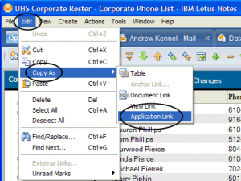
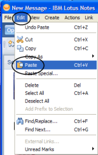

I had a training session today with a new employee. She is the new Admin Assistant to the #2 person in the company. It’s a rather important position, so I spent more time than I normally would on a simple training session like this. I walked her through the basics of email and calendar, with…

<!-- end -->

I had a training session today with a new employee. She is the new Admin Assistant to the #2 person in the company. It’s a rather important position, so I spent more time than I normally would on a simple training session like this. 

 
I walked her through the basics of email and calendar, with an emphasis on  the calendar, and stressed that she should call with any problems.
 
Later in the day, she did call with a list of databases she wanted access  to.  I took the opportunity in my reply to illustrate how Document and Database  links were created.  Here’s a copy of that section of my reply:
 
 

You start by opening the database/document you want to link to.

  

With the database open, click Edit…Copy As…Application Link. (In earlier versions of Notes, it was called Database Link instead of Application Link, but everything else worked the same way)

It will look like nothing has happened, but you now have the link in your clipboard.

Next create an email message. In the body of the message click Edit…Paste (Alternately, you can right-click and select Paste from the pop-up menu. Or, you can just press Ctrl-V on the keyboard.)

You’ll now see an icon like this:  The blue book icon means your link is to an application.

For a document link, you do basically the same thing, except that you would first open or select a document and then click Edit…Copy As…Document Link.

When you paste your link, it will look like this:  The yellow paper icon means that your link is to a document.

There is also another type of link called a View link. This opens a specific view in an application, for example Purchases Pending Approval in a Purchase Requisition system. A view link looks like this:

